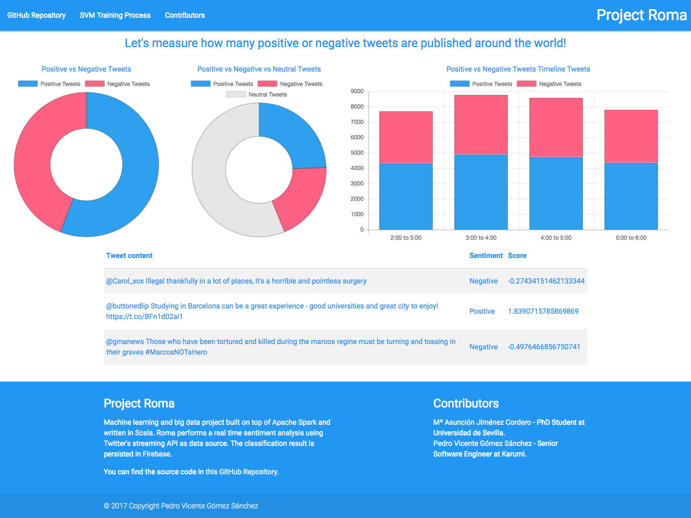
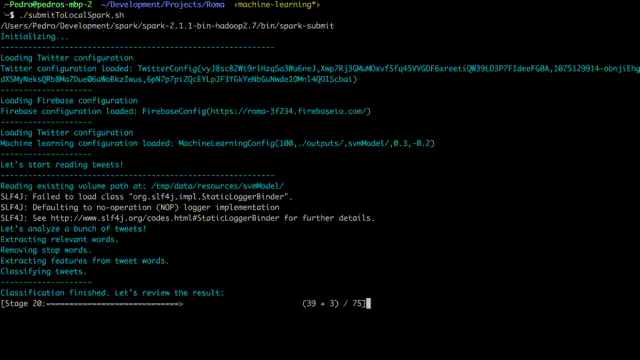
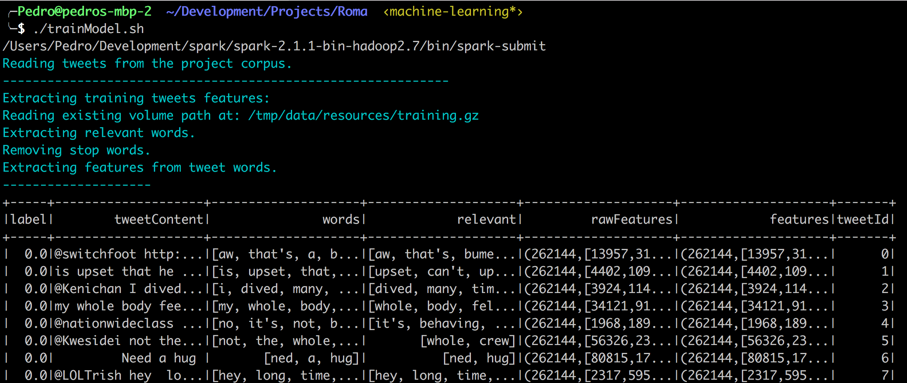
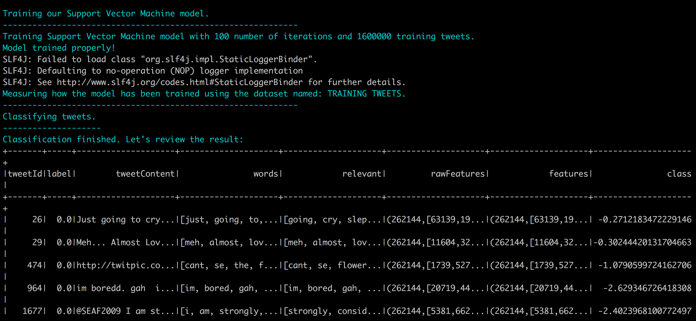
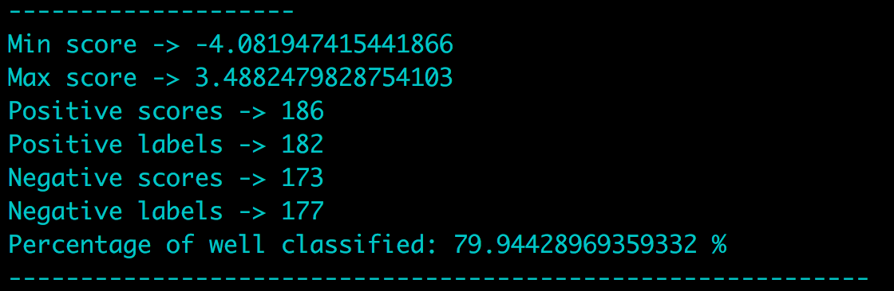
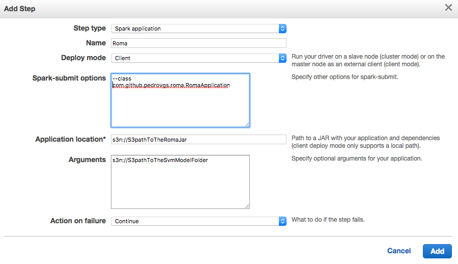

# Roma [](https://travis-ci.org/pedrovgs/Roma) [https://pedrovgs.github.io/Roma](https://pedrovgs.github.io/Roma)

Machine learning and big data project built on top of [Apache Spark](https://spark.apache.org/) and written in [Scala](https://www.scala-lang.org/). Roma performs a **real-time sentiment analysis using [Twitter's streaming API](https://dev.twitter.com/streaming/overview) as data source and [Support Vector Machine]((https://en.wikipedia.org/wiki/Support_vector_machine)) as machine learning algorithm.**

You can check the results of the real-time sentiment analysis from [https://pedrovgs.github.io/Roma/](https://pedrovgs.github.io/Roma/)

A more detailed blog post about how we developed this project can be found [here](http://blog.karumi.com/a-story-of-tweets-and-sentiments/).



## How does it work?

Using Twitter as input data and an already trained SVM model we can classify the incoming tweets into two different classess: ``positive`` and ``negative``. Content classified where the accuracy is not good enough, where we can't guarantee if the content is positive or negative, will not be classified. The classification result is persisted into [Firebase](https://firebase.google.com/).

We can split the project project components into two main entities: 

* ``RomaApplication``: Responsible of the streaming and real time tweets classification.
* ``RomaMachineLearningTrainer``: Responsible of the machine learning training and calssification metrics analysis.

Implementation details related to features extraction or the training process are quite interesting. We strongly recommend you to take a look at the implementation.

### Real time classification

Using [Spark Streaming API](https://spark.apache.org/streaming/) we've connected our application to the official Twitter Streaming API. **For every batch we use our already trained SVM Model to classify the streamed tweets as positive or negative**. Tweets classified as positive or negative are persisted into Firebase.

The following screencast shows the console output during the classification process:



The steps followed to classify tweets are:

* Load the application configuration needed to initialize the project.
* Configure the tweets stream using the Twitter OAuth configuration.
* Load the Firebase connection and the already trained classification model.
* For every batch of tweets we apply our SVM model to predict the classification. Tweets will be transformed into classified tweets.

**As SVM is a binary classification model and we need to discard some tweets and we can't always guarantee if the content is positive or negative we've applied a threshold to the prediction score generated as the result of the Support Vector Machine prediction.**

***The classification results and stats are saved into Firebase and the classification is performed into an AWS Cluster. We decided to use this storage platform and AWS because these platforms are free for some time and we don't have any sponsor for this project. Firebase does not support aggregation and we have to implement it manually. Even when the performance result is not the best, this implementation is the best we could get for free. In the future, if we have any sponsor for the systems infrastructure we will move the implementation to any other database.***

### Training

As Support Vector Machine is a supervised classification model we need to train it. To be able to generate an already trained model we need a corpus based on a training and testing tweets datasets already classified. Thanks to [Sentiment140](http://help.sentiment140.com/for-students/) **we've got a training dataset composed of 1.600.000 tweets into a GZIP file and a test dataset composed of 359 tweets.**

The steps followed to train our model are:

* Read the training and testing dataset.
* Filter and tokenize tweets content to be able to extract features easily.
* Extract tweet features.
* Train model.
* Measure classification results using our testing dataset.
* Save the model and use it to classify new tweets.

The following screenshots shows the console output shown during the training:

* Features extraction:



* Training process:



* Classification metrics:



**One important detail is related to the usage of [Apache Spark](https://spark.apache.org/mllib/). As we are using this big data and machine learning framework all the code related to the training or classification will be executed in parallel.**

The current training accuracy is close to the 80 % based on Sentiment140 training and testing datasets. In the future we'd like to improve our model based on an improved training dataset and an improved features extraction.

## Build and test this project

To build and test this project you can execute ``sbt test``. You can also use ``sbt`` interactive mode (you just have to execute ``sbt`` in your terminal) and then use the triggered execution to execute your tests using the following commands inside the interactive mode:

```
~ test
~ test-only *AnySpec
``` 

If you just need to assemble the ``jar`` you have to sent to the Apache Spark cluster you can simply execute ``sbt assembly``. If you need to repeatedly build the binary you can execute ``sbt`` to enter into the interactive mode and then execute ```~ assembly```.

## Configuration

This project needs some private Twitter OAuth configuration you can set creating a new file named ``application.conf`` into the ``/src/main/resources/`` folder. Here you have an example:

```
roma {
  twitter4j {
    oauth {
      consumerKey = YOUR_CONSUMER_KEY
      consumerSecret = YOUR_CONSUMER_SECRET
      accessToken = YOUR_ACCESS_TOKEN
      accessTokenSecret = YOUR_ACCESS_TOKEN_SECRET
    }
  }
  
  firebase {
    databaseUrl = YOUR_FIREBASE_DATABASE_URL
  } 

  machineLearning {
    numberOfIterations = 100
    outputFolder = "./outputs/"
    modelFileName = "svmModel"
    positiveThreshold = 0.3
    negativeThreshold = -0.2
  }
}  
```

If you want to review the classification results from a simple web-site you'll have to modify the file ``web/js/main.sj`` and initialize Firebase configuration using your own credentials. Here you have an example:

```js
var config = {
        apiKey: "YOUR API KEY",
        authDomain: "YOUR AUTH DOMAIN",
        databaseURL: "YOUR DATABASE URL",
        projectId: "YOUR PROJECT ID",
        storageBucket: "YOUR STORAGE BUCKET",
        messagingSenderId: "YOUR MESSAGING SENDER ID"
    };
```

You'll need to also add a new file named ``firebaseCredentials.json`` into the ``/src/main/resources/`` folder. You can get this file from your [Firebase console](https://console.firebase.google.com).

You can get these credentials by creating a Twitter application [here](https://apps.twitter.com/) and a new Firebase application [here](https://console.firebase.google.com).

## Trainig our SVM model

If after some changes during the features extraction or the trainig dataset you need to generate the model saved again you can easily follow these steps:

* Assembly the application executing ``sbt assembly``.
* Run the training script ``./trainModel.sh``.
* Review the classification metrics shown in the console logs.
* Move the recently generated model into the resources folder.

After the training process you'll see how a new folder named ``outputs/svmModel`` will appear and some classification metrics will be shown.

## Running on a cluster

Spark applications are developed to run on a cluster. Before to run your app you need to generate a ``.jar`` file you can submit to Spark to be executed. You can generate the ``roma.jar`` file executing ``sbt assembly``. This will generate a binary file you can submit using ``spark-submit`` command. Ensure your local Spark version is ``Spark 2.1.1``. 

You can submit this application to your local spark installation executing these commands:

``
sbt assembly
./submitToLocalSpark.sh
``

If at some point you need to run this on a cluster my recommendation is to use [Amazon EMR](https://aws.amazon.com/es/emr/). To get the job running on a cluster you have to follow these steps:

* Configure the ``application.conf`` and ``firebaseCredentials.json`` file as described below.
* Create an AWS account.
* Build the project using ``sbt assembly``.
* Upload to an amazon s3 bucket the binary you'll find in ``target/scala-2.11/roma.jar``.
* Upload to an amazon s3 bucket the ``svmModel`` folder found inside the resources directory.
* Create a cluster using ``Spark`` as application.
* Add a step to the cluster using the following configuration:



Once the step starts executing the Spark application you'll see how the web site is updated in real time using the classification stats and the classified tweets computed in the cluster.

Contributors
------------

* [Mª Asunción Jiménez Cordero](https://github.com/asuncionjc) - asuncionjc@us.es - PhD Student at Universidad de Sevilla. Thanks for all your contributions to this project and support during the development. Your machine learning support and knowledge was the key to success in this project.
* [Pedro Vicente Gómez Sánchez](https://github.com/pedrovgs) - Core contributor.

References
----------

* [Predicting the Political Alignement of Twitter Users](https://www.researchgate.net/publication/220876147_Predicting_the_Political_Alignment_of_Twitter_Users)
* [Twitter Trending Topic Classification](http://dl.acm.org/citation.cfm?id=2119627)
* [Detecting Spammers on Twitter](http://citeseerx.ist.psu.edu/viewdoc/summary?doi=10.1.1.297.5340)
* [Classifing Latent User attributes in Twitter](http://dl.acm.org/citation.cfm?id=1871993)
* [Earthquake Shakes Twitter Users: Real-Time Event Detection](http://citeseerx.ist.psu.edu/viewdoc/download?doi=10.1.1.183.8117&rep=rep1&type=pdf)

Developed By
------------

* Pedro Vicente Gómez Sánchez - <pedrovicente.gomez@gmail.com>

<a href="https://twitter.com/pedro_g_s">
  
</a>
<a href="https://es.linkedin.com/in/pedrovgs">
  
</a>

License
-------

    Copyright 2017 Pedro Vicente Gómez Sánchez

    Licensed under the GNU General Public License, Version 3 (the "License");
    you may not use this file except in compliance with the License.
    You may obtain a copy of the License at

       http://www.gnu.org/licenses/gpl-3.0.en.html

    Unless required by applicable law or agreed to in writing, software
    distributed under the License is distributed on an "AS IS" BASIS,
    WITHOUT WARRANTIES OR CONDITIONS OF ANY KIND, either express or implied.
    See the License for the specific language governing permissions and
    limitations under the License.

